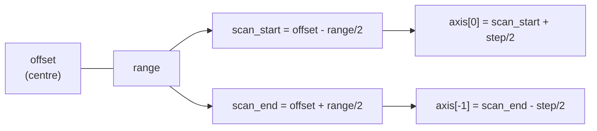

# Scan region, axes and scan direction

Every SPM vendor writes the geometry of a scan differently: some store a centre,
some a corner, some no range at all and some no scan direction. This section
states the single convention `pynxtools-spm` writes into NeXus, which raw element of
each format it comes from, and how strong the evidence for each reading is.

Where a vendor documents the meaning, the vendor is cited. Where no document was
found, the meaning was measured on published data and the measurement is shown,
so that anyone can repeat it or overturn it — see
[Challenge these findings](#challenge-these-findings).

## What you will find here

| Question | Short answer | Section |
|---|---|---|
| What does the scan offset point at? | The centre of the scanned area, for every flavour | [The convention](#the-convention) |
| How are `scan_start` and `scan_end` obtained? | `offset ∓ range/2`; never `offset` and `offset + range` | [The convention](#the-convention) |
| What do the axis values mean? | Pixel centres, `step = range / N` | [The convention](#the-convention) |
| Why are there two lists of axes? | `@axes` describes the image, `independent_scan_axes` the movement of the tip | [Two kinds of axes](#two-kinds-of-axes) |
| Where is the scan direction? | In the sign of `independent_scan_axes`, e.g. `-Y`; a bare `X` means unknown, or scanned both forward and backward | [Scan direction as a sign](#scan-direction-as-a-sign) |
| Which raw key does a value come from? | Per-flavour tables | [Raw-file elements per flavour](#raw-file-elements-per-flavour) |
| How certain is all this? | Graded per claim, vendor manual down to none | [Evidence and confidence](#evidence-and-confidence) |

## Fields the reader writes

| NeXus field | Group | Meaning | Derived from |
|---|---|---|---|
| `scan_offset_value_x`, `_y` | `NXspm_scan_region` | Centre of the scanned area | Vendor key, converted to a centre if the vendor stores a corner |
| `scan_range_x`, `_y` | `NXspm_scan_region` | Width and height of the area | Vendor key, or `points × pitch` when not stored |
| `scan_start_x`, `_y` | `NXspm_scan_region` | Low edge of the area | `offset - range/2` |
| `scan_end_x`, `_y` | `NXspm_scan_region` | High edge of the area | `offset + range/2` |
| `scan_angle_x`, `_y` | `NXspm_scan_region` | Rotation of the scan frame | Vendor key; not applied to the data |
| `scan_points_x`, `_y` | `NXspm_scan_pattern` | Pixels per line, number of lines | Vendor key |
| `step_size_x`, `_y` | `NXspm_scan_pattern` | Pixel pitch | `range / points` |
| `AXISNAME` (`X`, `Y`) | `NXdata` | Position of each pixel centre | `offset - range/2 + (i + 0.5) × step` |
| `@axes` | `NXdata` | Axis of each data dimension | `[Y, X]`, dimension 0 first |
| `independent_scan_axes` | `NXspm_scan_control` | Scan axes, fastest to slowest; signed with the scan direction, or bare when that is unknown or both passes were scanned | Vendor direction key |

## The convention

### Offset is the centre of the scan area

```text
scan_start_n = offset_n - range_n / 2
scan_end_n   = offset_n + range_n / 2
```

`scan_start = offset` with `scan_end = offset + range` is never used. When a
format stores a corner instead of a centre, the corner is shifted first,
`offset = corner + range/2`, and the relations above are applied to it. Start and
end are always derived, even where a format has a start-like key of its own.



### Axis values are pixel centres

An axis value is the centre of its pixel, not its edge, so pixel `i` of `N` sits
at `offset - range/2 + (i + 0.5) × step` with `step = range / N`. The first and
last axis values are therefore half a pixel inside the scan region, and the
midpoint of any axis is exactly the scan offset. Placing the coordinate at the
pixel centre is this reader's choice; no vendor prescribes it.

### Frames of reference

| Frame | What it is | Fields in it |
|---|---|---|
| Scanner (piezo) | Position within the scanner range, measured from its undeflected centre | `scan_offset_value_*`, `scan_start_*`, `scan_end_*` |
| Stage | Coarse position of the head or sample holder | Vendor stage keys, e.g. Bruker `\Stage X`; never combined with the offset |
| Sample | Where a feature physically sits | Can be reconstructed only by combining the stage position with the scanner frame |

A non-zero `scan_angle_*` rotates the scan frame against the sample, so `X` and
`Y` are the fast and the slow axis of the **scan frame**, not the x and y of the
sample. The angle is recorded but never applied to the data.

### Image orientation

Images follow the bottom-left convention: row 0 is the bottom row, column 0 the
left column, and both axes ascend. An up scan and a down scan of the same area
give the same image; only the order in which the lines were recorded differs.

## Two kinds of axes

`@axes` and `independent_scan_axes` answer different questions and are written
independently of each other.

| | `@axes` (`NXdata`) | `independent_scan_axes` (`NXspm_scan_control`) |
|---|---|---|
| Question answered | How should the image be displayed? | How did the tip move over the sample? |
| Order | Dimension order, `[slow, fast]` = `[Y, X]` | Fastest to slowest, `[±X, ±Y]` |
| Case | Upper case | Upper case |
| Sign | Never signed | Signed with the scan direction where known |
| Affected by the image flips | Yes, it describes the stored image | No, it describes the measurement |

### Scan direction as a sign

| Value | Meaning |
|---|---|
| `+Y` | The axis was traveled towards increasing Y |
| `-Y` | The axis was traveled towards decreasing Y |
| `Y` | No single direction is asserted, or the direction is unknown |

An axis is signed when the entry holds exactly one pass along it **and** the
format records which way that pass ran.

A bare axis covers two different situations, which the file itself tells apart:

- **Both passes are stored.** The entry has a forward and a backward `NXdata`
  group, so no single direction applies to the fast axis.
- **The format never records it.** Bruker `.FLT` stores one channel and no slow
  scan direction, so its `Y` means unknown, not upward.

## Raw-file elements per flavour

Each flavour has its own section with the full key table, how its scan direction
is decided and what it leaves unrecorded. Click a flavour to open it.

| Flavour | Extension | Offset | Range | Points | Direction | Unit | Angle |
|---|---|---|---|---|---|---|---|
| [Nanonis](scan-region/nanonis-sxm.md) | `.sxm` | `:SCAN_OFFSET:` | `:SCAN_RANGE:` | `:SCAN_PIXELS:` | `:SCAN_DIR:` | `/Z-Controller/Z` unit | `:SCAN_ANGLE:` |
| [Bruker NanoScope](scan-region/bruker-spm.md) | `.spm` | `\X Offset`, `\Y Offset` | `\Scan Size`, `\Aspect Ratio` | `\Samps/line`, `\Lines` | `\Frame direction` | In the value, e.g. `20000 nm` | `\Rotate Ang.` |
| [Bruker SPMLab](scan-region/bruker-flt.md) | `.FLT` | `OffsetX`, `OffsetY` | `ScanRangeX`, `ScanRangeY` | `ResolutionX`, `ResolutionY` | `ScanDirection` | Suffix of the value, e.g. `1.0000 µm` | `Rotation` |
| [Omicron / RHK](scan-region/omicron-sm4.md) | `.sm4` | `RHK_Xoffset`, `RHK_Yoffset` | not stored | `RHK_Xsize`, `RHK_Ysize` | sign of `RHK_Yscale` | `RHK_X/@unit`, `RHK_Y/@unit` | `RHK_Angle` |
| [No raster](#no-raster-nanonis-dat-sts-and-bruker-spmtxt) | `.dat`, `.spm.txt` | — | — | — | — | — | — |

### No raster: Nanonis `.dat` STS and Bruker `.spm.txt`

Neither flavour rasters an area, so neither writes a 2D scan region or
`independent_scan_axes`.

| Flavour | What is written instead |
|---|---|
| Nanonis `.dat` STS | `scan_start_bias`, `scan_end_bias` and `scan_offset_bias`, read directly from `Bias Spectroscopy>Sweep Start (V)`, `>Sweep End (V)` and `Bias>Offset (V)` |
| Bruker `.spm.txt` | A `point_forceSCAN` group; start, end and range of both halves of the ramp come from the first and last element of `/Calc_Ramp_Ex_nm` and `/Calc_Ramp_Rt_nm` |

## Evidence and confidence

### Grades

| Grade | Definition |
|---|---|
| Vendor manual | A document published by the instrument maker defines the parameter |
| Empirical test | Raw files from the vendor's software where the geometry can be measured, and only one reading fits |
| Vendor file content | Something the vendor's software writes into the file that fits only one reading |
| Third-party reader | An independent open-source reader, e.g. Gwyddion; how the community reads the value, not how the vendor defines it |
| None | No source found |

### What each claim rests on

| Claim | Flavour | Grade | Source |
|---|---|---|---|
| Offset is the centre | Bruker `.spm` | Vendor manual | [NanoScope 6.13 User Guide](https://afmhelp.com/docs/manuals/Nanoscope6.13UserGuide.pdf), p. 60 |
| Offset is the centre | Omicron `.sm4` | Vendor manual + empirical test | [RHK R9 User Manual](https://www.manualslib.com/manual/2808818/Rhk-Technology-R9.html?page=195), p. 195, and the [measurement](scan-region/omicron-sm4.md#evidence) |
| Offset is the centre | Nanonis `.sxm` | Vendor file content + third-party readers | `:Scan>Scanfield:` in the files; [Gwyddion `nanonis.c`](https://sourceforge.net/p/gwyddion/code/HEAD/tree/trunk/gwyddion/modules/file/nanonis.c) |
| Offset is the centre | Bruker `.FLT` | Empirical test | [Measurement](scan-region/bruker-flt.md#evidence) |
| Pitch is `\|scale\|`, range is `N × \|scale\|` | Omicron `.sm4` | Third-party readers | [Gwyddion `rhk-sm4.c`](https://sourceforge.net/p/gwyddion/code/HEAD/tree/trunk/gwyddion/modules/file/rhk-sm4.c); [MATLAB `sm4reader`](https://www.mathworks.com/matlabcentral/fileexchange/62561-sm4reader-fileid) |
| Sign of `RHK_Yscale` is the slow direction | Omicron `.sm4` | Third-party reader | [Gwyddion forum](https://sourceforge.net/p/gwyddion/discussion/fileformats/thread/3377ed98fa/) |
| Row order and image flips | All image flavours | Third-party reader | Gwyddion import modules, verified against every test file |

### How the empirical test works

A small scan taken inside a larger scan of the same area shows up as a patch of
the large image. Where the patch is **found** is a measurement; where each
reading of the offset **predicts** it differs by `(range_big - range_small) / 2`
per axis. The small image is resampled to the pixel size of the large one, both
are line- and plane-levelled, and the patch is located by normalized
cross-correlation.

Pairs whose two scans share the same offset are the clearest: a centre reading
puts the small scan in the middle of the large one, a corner reading in a corner,
and that holds whatever the axis directions are.

In the results below, **Measured** is where the small scan was found, while
**Centre predicts** and **Corner predicts** are the positions computed from the
raw offsets under each reading. Whichever prediction the measurement matches is
the reading the file follows.

The measured results are shown with the flavour they concern:
[Bruker SPMLab `.FLT`](scan-region/bruker-flt.md#evidence) and
[Omicron / RHK `.sm4`](scan-region/omicron-sm4.md#evidence).

### Data used

| Flavour | Files | Where | License |
|---|---|---|---|
| Bruker `.FLT` | `PMIS2-C8_ML2_p1_5__040925135420.SIG_HEIGHT_SENSOR_FRW.FLT`, `PMIS2-C8_ML2_p1_20__040925132340.SIG_HEIGHT_SENSOR_FRW.FLT` | [In this repository](../assets/empirical_offset_test/README.md), and in `AFM.zip` of [10.5281/zenodo.18060234](https://doi.org/10.5281/zenodo.18060234) | CC BY 4.0 |
| Omicron `.sm4` | `VT231211_A1_0064.sm4`, `VT231211_A1_0065.sm4`, `VT231205_A1_0063.sm4`, `VT231205_A1_0064.sm4` | [10.5281/zenodo.14268803](https://doi.org/10.5281/zenodo.14268803); the record holds many more files, so take these four by name | CC BY 4.0 |

## Challenge these findings

Four of the claims above rest on measurement or on third-party readers rather
than on a vendor document. If you can show one of them is wrong, the reader
should change.

| Claim | Evidence that would overturn it |
|---|---|
| The [`.FLT` offset is the centre](scan-region/bruker-flt.md) | A Veeco, ThermoMicroscopes or Bruker Innova document defining `OffsetX`, or scans of one area that the centre reading misplaces |
| The [`.sm4` range is `N × \|scale\|`](scan-region/omicron-sm4.md) | The RHK "SM4 Data File Format" document, or a calibration grating measured against the written range |
| The [`.sm4` fast axis has no recorded direction](scan-region/omicron-sm4.md) | A field in the page header, or the RHK format document, that gives it |
| [Nanonis `SCAN_OFFSET` is the centre](scan-region/nanonis-sxm.md) | The SPECS TCP Protocol Document, if it says otherwise |

Please open an issue with the
[Challenge a scan-region convention](https://github.com/FAIRmat-NFDI/pynxtools-spm/issues/new?template=challenge-a-convention.yml)
template. A vendor document is the strongest evidence; an openly licensed raw
file that the current reading gets wrong is just as welcome, because it can be
added to the test set.

## References

| Source | What it establishes | Link |
|---|---|---|
| NanoScope 6.13 User Guide, pp. 60, 85 | Bruker `.spm` offset is the centre position of the scan | [PDF](https://afmhelp.com/docs/manuals/Nanoscope6.13UserGuide.pdf) |
| Bruker help, Zoom and Offset Buttons | The Offset command centres the scan and updates X/Y Offset | [Page](https://www.nanophys.kth.se/nanolab/afm/icon/bruker-help/Content/SoftwareGuide/Realtime/Tips/ZoomAndOffsetButtons.htm) |
| Bruker help, Scan View Parameters Tips | X/Y Offset use the sample as position reference | [Page](https://www.nanophys.kth.se/nanolab/afm/icon/bruker-help/Content/SoftwareGuide/Realtime/Tips/ScanViewParametersTips.htm) |
| Bruker help, Frame Commands | Frame Up and Frame Down restart the scan at the bottom and the top | [Page](https://www.nanophys.kth.se/nanolab/afm/icon/bruker-help/Content/SoftwareGuide/Realtime/Tips/FrameCommands.htm) |
| RHK R9 User Manual, pp. 59, 195, 197 | XY Offsets of 0 centre the scan area in the scan range | [Manual](https://www.manualslib.com/manual/2808818/Rhk-Technology-R9.html?page=195) |
| Park Scientific, User's Guide to AutoProbe CP, pp. 4-17 f. | SPMLab's ancestor keeps the offset in scanner coordinates, referenced to the undeflected scanner | [Scan](https://utw10193.utweb.utexas.edu/InstrumentManuals/micro-nano-afm-cp%20auto-prob-user-manual.pdf) |
| Nanonis SXM format description | The SXM header tags and the data block layout | [GXSM tracker](https://sourceforge.net/p/gxsm/plugin-requests/3/) |
| `nanonis_control` | Documents the Nanonis scan frame as centre, size and angle | [Repository](https://github.com/dilwong/nanonis_control) |
| Gwyddion `nanonis.c`, `nanoscope.c`, `spmlabf.c`, `rhk-sm4.c` | Community reading of each format, including the image flips | [Source tree](https://sourceforge.net/p/gwyddion/code/HEAD/tree/trunk/gwyddion/modules/file/) |
| spym | Reference Python reader for RHK SM4 | [Repository](https://github.com/rescipy-project/spym) |
| MATLAB `sm4reader` | Computes the SM4 scan size as `\|scale\| × points` | [File Exchange](https://www.mathworks.com/matlabcentral/fileexchange/62561-sm4reader-fileid) |
