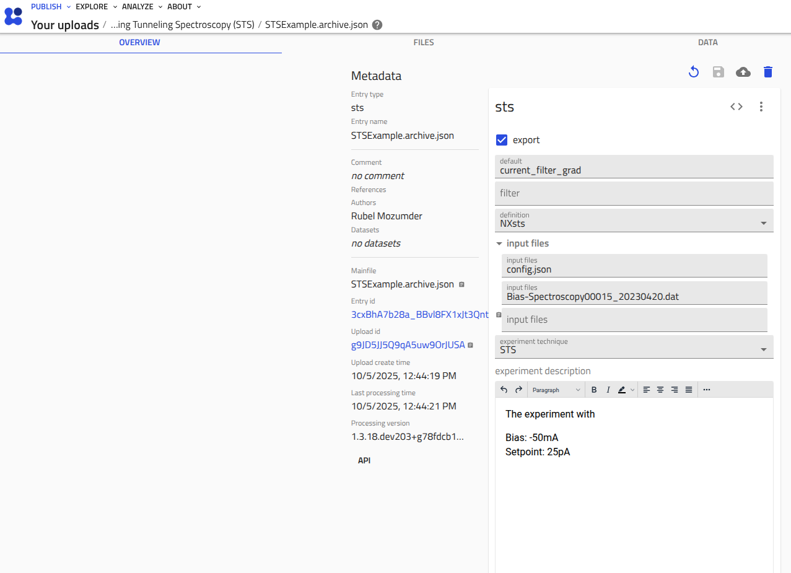

# How to Use the Reader

## __Input Files__

The reader requires specific input files for its operation. These files are typically generated by the experiment instrument and include an ELN file with user-provided metadata or an ELN schema file to write your metadata via NOMAD. Below, we discuss the input files and how they are used in different situations.

The reader primarily requires three types of input files:

### __Raw Data File__

The raw data file is generated by the instrument's software. These files may contain measured data, instrument setup, and some metadata, but not all required information may be present. The metadata and instrument setup information required by the NeXus application definition can be supplied via the ELN file.

=== "A Nanonis STS Raw Data File"
    <div class="scrollable">
    ```text
    --8<-- "included_file_content/sts/Bias-Spectroscopy00015_20230420.dat"
    ```
    </div>
    After parsing the raw data file it will be formatted as (Only a small part of the formatted data is shown here):
    <div class="scrollable">
    ```json
        {'/Experiment/value': 'bias spectroscopy',
        '/Saved Date/value': '20.04.2023 14:55:09',
        '/value': '[DATA]',
        '/X/unit': 'm',
        '/X/value': '153.514E-9',
        '/Y/unit': 'm',
        '/Y/value': '-93.4937E-9',
        '/Z/unit': 'm',
        '/Z/value': '62.8795E-9',
        '/Z offset/unit': 'm',
        '/Z offset/value': '0E+0',
        '/Settling time/unit': 's',
        '/Settling time/value': '2E-3',
        '/Integration time/unit': 's',
        '/Integration time/value': '1E-3',
        }
    ```
    </div>

<!-- TODO: Add how raw path is formatted by parsers. -->
<!-- TODO: Mention on the home page that to use this package, users must have good knowledge of NeXus semantics and application definitions for SPM. -->

### __ELN Schema File__

A YAML schema file (with an extension `.scheme.archive.yaml`) contains the schema structure according to the NeXus application definition and some operational metadata for NOMAD. NOMAD reads this schema file and creates an archive file (with an extension `.archive.json`). Later, NOMAD renders a GUI representing the archive file, where users can fill metadata corresponding to the NeXus schema. NOMAD then generates a structured YAML file (another type of ELN file with an extension `.yaml`) that collects the user-provided data. The final ELN file (with an extension `.yaml`) is read by reader, and the data is written to the NeXus file. For a visualization of this process, follow the `Drag and Drop Example in NOMAD` in [Use Reader in NOMAD](../tutorials/use-reader-in-nomad.md).

In the tabbed window below, an example ELN schema file for an STS experiment is shown. The schema is designed according to the NeXus application definition `NXsts`. The schema file contains all required metadata fields that are not supplied by the raw file but are required by the `NXsts` application definition. Tabs from left to right show the schema file, the generated archive file, the graphical representation of the archive file in NOMAD, and the final ELN file (with the extension `.yaml`).

=== "STS Schema for NOMAD (sts.scheme.archive.yaml)"
    <div class="scrollable">
    ```yaml
    ---8<-- "included_file_content/sts/sts.scheme.archive.yaml"
    ```
    </div>
=== "Archive File (sts.archive.json)"
    <div markdown="1" class=scrollable>
    ```json
    --8<-- "included_file_content/sts/STSExample.archive.json"
    ```
    </div>
=== "Graphical Representation of archive.json in NOMAD"
    <div class="scrollable-img">
        
    </div>
=== "Eln yaml file (generated by NOMAD)"
    <div class="scrollable">
    ```yaml
    --8<-- "included_file_content/sts/eln_data.yaml"
    ```
    </div>


### __ELN YAML File__

An ELN YAML file is similar to the YAML file (with an extension `.yaml`) generated by NOMAD from the ELN schema file (with the extension `.scheme.archive.yaml`). This ELN YAML file also contains the same structure as the application definition but is much simpler than the __ELN Schema File__. Such a file can be written by the user following the application definition `NXsts` without the help of NOMAD. This ELN file is only compatible with reader if the reader is invoked via the command-line interface (see [Standalone Usages](../reference/standalone-usages.md) guide).

=== "Eln yaml file (user provided)"
    <div class="scrollable">
    ```yaml
    --8<-- "included_file_content/sts/eln_data.yaml"
    ```
    </div>

### __Config File__

The config file carries mapping information from raw data to the NeXus Application Definition concepts. The config file follows certain rules for how the raw data will be processed and organized in the NeXus file. It is expected that lab users scrutinize the config file and modify it according to their needs. The file does not need to be modified for the underlying data model according to the application definitions, only for raw data paths.

=== "Typical structure of config file (for nanonis STS data)"
    <div class="scrollable">
    ```json
    --8<-- "included_file_content/sts/config.json"
    ```
    </div>

#### __Modification Rules for `config.json` File__

__1.__ The simplest way to map NeXus concepts (fields and/or attributes) to the raw data file is to use a map from the concept name to a map object.
=== "Map for NeXus concept `field`"
    <p>The field <b>reference_frequency</b> of <b>lockin_amplifier</b> group is mapped to an object containing "raw_path" and attributes e.g., "units", "demo_attr".
    The "raw_path" refers to the path of raw data (e.g., <it>/Lock-in/Frequency/value</it>) in experiment files.</p>
    <div class="scrollable">
    ```json
    "lockin_amplifier": {
        "reference_frequency": {
        "raw_path": "/Lock-in/Frequency/value",
        "@units": "/Lock-in/Frequency/unit",
        "@demo_attr": "/path/to/demo/value"
        },
    }
    ```
    </div>
=== "Map for NeXus concept `attribute`"
    <p>The attribute <b>attribute</b> of <b>entry</b> group is mapped to an object containing "raw_path".
    The "raw_path" refers to a path of raw data (e.g., <it>/NanonisMain/Experiment name/value</it>).
    <div class="scrollable">
    ```json
    "ENTRY[entry]": {
        "@attribute": { "raw_path": "/NanonisMain/Experiment name/value" },
    }
    ```
    </div>
__2.__ Set default values for a concept (field and/or attribute) via the config file
=== "Default Value for NeXus `field`"
    <p>A default value of a NeXus field <b>modulation_signal</b> field of <b>lockin_amplifier</b> can be set using the syntax "<b>@default:<_value_></b>". 
    </p>
    <div class="scrollable">
    ```json
    "lockin_amplifier": {
        "modulation_signal": {
        "raw_path": "@default:current"
        },
    }
    ```
    </div>
=== "Default Value for NeXus `attribute`"
    <p>A default value of a group attribute "<b>attribute</b>" of <b>entry</b> can be set by syntax "<b>@default:<_value_></b>".</p>
    <div class="scrollable">
    ```json
    "ENTRY[entry]": {
        "@attribute": { "raw_path": "@default:current_grad" },
    }
    ```
    </div>

__3.__ Use the config file to define variadic names for concepts like groups, fields, and attributes. In NeXus concepts, a part or the entire concept name can be modified while instantiating the objects, allowing multiple instances of the same concept.

=== "Variable name for NeXus `group`"
    <p>Define variadic name for the group <b>TEMPERATURE[temperature]</b> of <b>INSTRUMENT</b> group using a map to one dimensional array of objects.
    Each element of the array is an object mapping from embedding part of name to the raw data paths or nested concepts. The example array leads two instances of
    <b>TEMPERATURE[head_temperature_sensor]</b> and <b>TEMPERATURE[sample_temperature_sensor]</b>.
    </p>
    <div class="scrollable">
    ```json
    "INSTRUMENT[instrument]": {
        "TEMPERATURE[temperature]": [
            {"head_temperature_sensor":{ 
                "CHANNEL_temp[channel_temp]": {
                    "raw_path": "/Temperature 1/Temperature 1/value",
                    "@units": "/Temperature 1/Temperature 1/unit"
                    }
                }
            },
            {"sample_temperature_sensor": {
                "CHANNEL_temp[channel_temp]": {
                    "raw_path": "/Temperature 2/Temperature 2/value",
                    "@units": "/Temperature 2/Temperature 2/unit"
                    }
                }
            }
        ]
    }
    ```
    </div>
    <p> Or, simply write multiple groups like they are independent of each other.</p>
    <div class="scrollable">
    ```json
    "INSTRUMENT[instrument]": {
        "TEMPERATURE[head_temperature_sensor]": {
            "CHANNEL_temp[channel_temp]": {
                "raw_path": "/Temperature 1/Temperature 1/value",
                "@units": "/Temperature 1/Temperature 1/unit"
                }
            },
        "TEMPERATURE[sample_temperature_sensor]": {
            "CHANNEL_temp[channel_temp]": {
                "raw_path": "/Temperature 2/Temperature 2/value",
                "@units": "/Temperature 2/Temperature 2/unit"
                }
            },
    }
    ```
    </div>
=== "Variable name for NeXus `field`"
    <p>Define variadic name for the field <b>second_order_correction_N[second_order_correction_n]</b> of <b>piezo_configuration</b> group using one dimensional array of objects.
    Each element of an array is an object mapping embedding part to the raw data path. The array leads a field <b>second_order_correction_N[second_order_correction_n]</b> to two instances, <b>second_order_correction_N[second_order_correction_x]</b> and <b>second_order_correction_N[second_order_correction_y]</b>.
    </p>
    <div class="scrollable">
    ```json
    "piezo_sensor": {
        "piezo_configuration": {
            "second_order_correction_N[second_order_correction_n]": [
            {
                "x": {
                "raw_path": "/Piezo Configuration/2nd order corr X/value",
                "@units": "/Piezo Configuration/2nd order corr X/unit"
                }
            },
            {
                "y": {
                "raw_path": "/Piezo Configuration/2nd order corr Y/value",
                "@units": "/Piezo Configuration/2nd order corr Y/unit"
                }
            }
            ],
        }
    }
    ```
    </div>
    <p> Or, simply write multiple fields like they are independent of each other.</p>
    <div class="scrollable">
    ```json
    "piezo_sensor": {
        "piezo_configuration": {
            "second_order_correction_N[second_order_correction_x]": {
                "raw_path": "/Piezo Configuration/2nd order corr X/value",
                "@units": "/Piezo Configuration/2nd order corr X/unit"
            },
            "second_order_correction_N[second_order_correction_y]": {
                "raw_path": "/Piezo Configuration/2nd order corr Y/value",
                "@units": "/Piezo Configuration/2nd order corr Y/unit"
            }
        }
    }
    ```
    </div>
=== "Variable name for NeXus `attribute`"
    <p>Similar to the field, a variadic attribute can have multiple instances. For sake of the explanation, let consider, <b>configurationNAME[configuration_name]</b> 
    is a variadic attribute of the <b>piezo_configuration</b> group. This situation can be written in config file, attribute <b>configurationNAME[configuration_name]</b> will be modified with multiple instances as <b>configurationNAME[configuration_name_x]</b> and <b>configurationNAME[configuration_name_y]</b>.</p>
    <div class="scrollable">
    ```json
    "piezo_sensor": {
        "piezo_configuration": {
            "@configurationNAME[configuration_name]": [
            {
                "name_x": {
                "raw_path": "attribute:@attribute:x_configuration"
                },
            },
            {
                "name_y": {
                "raw_path": "attribute:@attribute:y_configuration"
                }
            }
            ]
        },    
    }
    ```
    </div>
    <p> Or, simply write multiple attributes like they are independent of each other.</p>
    <div class="scrollable">
        ```json
        "piezo_sensor": {
            "piezo_configuration": {
                "@configurationNAME[configuration_name_x]": {
                    "raw_path": "attribute:@attribute:x_configuration"
                },
                "@configurationNAME[configuration_name_y]": {
                    "raw_path": "attribute:@attribute:y_configuration"
                }
            },    
        }
        ```
    </div>
__4.__ Write customized `NXdata` groups via the config file. It is often necessary for a user to annotate plots by defining the axis name and plot title.

=== "Customized `NXdata group`"
    <p>The <b>NXdata</b> can represent multiple instances of plottable data. Each set is defined by an object in the array of <b>DATA[data]</b>.
    Each object contains  <b>data</b> key referring the <b>DATA</b> field of <b>NXdata</b> base class, string of numbers (e.g., <b>"0"</b>, <b>"1"</b>) referring the index of the independent axis variable(s) for the <b>data</b>, <b>title</b> key for <b>title</b> field of <b>NXdata</b> group, and <b>grp_name</b> key defining the instance name of the <b>NXdata</b> group.
    <div class="scrollable">
    ```json
    "DATA[data]": [
        {
            "data": {
            "name": "Current",
            "raw_path": "/dat_mat_components/Current/value",
            "@units": "/dat_mat_components/Current/unit"
            },
            "0": {
            "name": "Bias Voltage",
            "raw_path": [
                "/dat_mat_components/Bias calc/value",
                "/dat_mat_components/Bias/value"
            ],
            "@units": [
                "/dat_mat_components/Bias calc/unit",
                "/dat_mat_components/Bias/unit"
            ]
            },
            "title": { "raw_path": "@attribute:Bias Spectroscopy" },
            "grp_name": "current"
        },
        {
            "data": {
            "name": "Current_filter",
            "raw_path": "/dat_mat_components/Current [filt]/value",
            "@units": "/dat_mat_components/Current [filt]/unit"
            },
            "0": {
            "name": "Bias Voltage",
            "raw_path": [
                "/dat_mat_components/Bias [filt]/value",
                "/dat_mat_components/Bias calc/value",
                "/dat_mat_components/Bias/value"
            ],
            "@units": [
                "/dat_mat_components/Bias calc/unit",
                "/dat_mat_components/Bias/unit"
            ]
            },
            "title": { "raw_path": "@attribute:Bias Spectroscopy(filter)" },
            "grp_name": "Current_filter"
        }
    ]
    ```
    </div>

__5.__ The `nxformatter` of `pynxtools-spm` has common functions, methods, and other programmatic tools that use the common rules in the config file as described above. The curated concepts should be written in the `template` object of `pynxtools`. However, there may be special cases where the generalized functions and methods do not work. In such cases, customized methods handle the special fields. To annotate which concepts or fields need special treatment, the config file has a key `#note`. The value of `#note` holds a human-readable description, e.g., the name of the method that handles the special case. The class variable `_grp_to_func` must have a map from the group name to the method name.

=== "Special case annotation via `#note` key"
    <p>This group <b>BIAS_SWEEP[bias_sweep]</b> is considered as a group that should be handled in a special method called <b>_construct_bias_sweep_grp</b>. To annotate this special case and information, the key <b>#note</b> is used.</p>
    <div class="scrollable">
    ```json
    "BIAS_SWEEP[bias_sweep]": {
        "#note": "This group will be handled in _construct_bias_sweep_grp.",
        "scan_type": "",
        "settling_time": {
            "raw_path": "/Bias Spectroscopy/Settling time/value",
            "@units": "/Bias Spectroscopy/Settling time/unit"
            },
    }
    ```
    </div>
    <p>And the class variable `_grp_to_func` look like this:</p>
    <div class="scrollable">
    ```python
    class NanonisDatSTS(NanonisBase):
        """Formatter for Nanonis STS data with .dat extension"""

        _grp_to_func = {
            "BIAS_SWEEP[bias_sweep]": "_construct_bias_sweep_grp", # Group name must start with "BIAS_SWEEP"
        }
    ```
    or
    ```python
    class NanonisDatSTS(NanonisBase):
        """Formatter for Nanonis STS data with .dat extension"""

        _grp_to_func = {
            "BIAS_SWEEP": "_construct_bias_sweep_grp", # Group name must start with "BIAS_SWEEP"
        }
    ```
    </div>

### __Attribute Features of `pynxtools-spm`__

There are some attribute features to handle raw data from specific vendor files.

__1.__ In STM, for Omicron raw files, the `SPM_SCAN_CONTROL[spm_scan_control_*]` group is instantiated for individual scans, e.g., `current_forward`, `current_backward`, `topography_forward`, `topography_backward`, etc.

=== "Multiple instances of `SPM_SCAN_CONTROL`"
    <p>In convention <b>SPM_SCAN_CONTROL[spm_scan_control_\*]</b> the replacing part is <b>\*</b>. For each scan, the instance name shall be something like <b>SPM_SCAN_CONTROL[spm_scan_control_current_forward]</b>. As the name <b>SPM_SCAN_CONTROL</b> is fully replaceable, one can wish to define the instance name as he want, e.g, in the config file, <b>SPM_SCAN_CONTROL[\*]</b> or <b>SPM_SCAN_CONTROL[any_prefix_\*_any_suffix]</b> both are allowed but one asterisk wildcard <b>*</b> must be provided.</p>.
    <div class="scrollable">
    ```json
    "SCAN_ENVIRONMENT[scan_environment]": {
        "SPM_SCAN_CONTROL[spm_scan_control_*]": {
          "#note": "Handled in function _construct_nxscan_controllers. With '*' it is possible to add scan names, e.g., current_backward.",
          "scanTAG[scan_name]": {
            "raw_path": ""
          },
          "meshSCAN[mesh_scan]": {
            "backward_speedN[backward_speed_n]": {
              "raw_path": "",
              "@units": ""
            },
          },
        },
    }
    ```
    </div>

## __Some Useful Tips__

The code usages outside the reader is sometimes necessary for developers or users, especially when encountering errors or unexpected behavior.

__1.__ The parsers in `pynxtools-spm` parse a raw data file and organize the data in a slash-separated dictionary. The slash-separated keys represent the hierarchical structure followed in the raw file. To investigate how the raw data is organized, you can use the following code snippets.

=== "Parse a Nanonis file from STS Experiment"
    <div class="scrollable">
    ```python
    from pynxtools_spm.parsers.nanonis_dat import NanonisDatSTS

    raw_file = "path/to/your/file.dat"

    parser: Dict[str, Any] = NanonisDatSTS(raw_file).parse()
    ```
    </div>
=== "Parse a Nanonis file from STM Experiment"
    <div class="scrollable">
    ```python
    from pynxtools_spm.parsers.nanonis_sxm import SxmGenericNanonis

    raw_file = "path/to/your/file.dat"

    parser: Dict[str, Any] = SxmGenericNanonis(raw_file).parse()
    ```
    </div>
=== "Parse an Omicron file from STM Experiment"
    <div class="scrollable">
    ```python
    from pynxtools_spm.parsers.omicron_sm4 import Sm4Omicron

    raw_file = "path/to/your/file.sxm"

    parser: Dict[str, Any] = Sm4Omicron(raw_file).parse()
    ```
    </div>

__2.__ The aim of the `nxformatter` of `pynxtools-spm` is to curate the raw data and ELN data. Later, the curated data is stored in a `template` object of `pynxtools`. To investigate how the data is curated, you can use the following code snippets.

=== "Curate a Nanonis File from STS Experiment"
    <div class="scrollable">
    ```python

    from pynxtools.dataconverter import helpers
    from pynxtools.dataconverter.template import Template

    from pynxtools_spm.formatters.nanonis.nanonis_dat_sts import NanonisDatSTS

    nxdl_name = "NXsts"
    if nxdl_root is None:
        nxdl_root, _ = helpers.get_nxdl_root_and_path(nxdl=nxdl_name)

    template = Template()
    helpers.generate_template_from_nxdl(nxdl_root, template)

    raw_file = "path/to/your/file.dat"
    eln_file = "path/to/your/file.yaml"
    config_file = "path/to/your/config.json"

    formatter = NanonisDatSTS(template=template, raw_file=raw_file, 
                              eln_file=eln_file, config_file=config_file)
    
    curated_template: Template = formatter.get_nxformatted_template()

    ```
    </div>
=== "Curate a Nanonis File from STM Experiment"
    <div class="scrollable">
    ```python

    from pynxtools.dataconverter import helpers
    from pynxtools.dataconverter.template import Template

    from pynxtools_spm.formatters.nanonis.nanonis_sxm_stm import NanonisSxmSTM

    nxdl_name = "NXstm"
    if nxdl_root is None:
        nxdl_root, _ = helpers.get_nxdl_root_and_path(nxdl=nxdl_name)

    template = Template()
    helpers.generate_template_from_nxdl(nxdl_root, template)

    raw_file = "path/to/your/file.sxm"
    eln_file = "path/to/your/file.yaml"
    config_file = "path/to/your/config.json"

    formatter = NanonisSxmSTM(template=template, raw_file=raw_file, 
                              eln_file=eln_file, config_file=config_file)
    
    curated_template: Template = formatter.get_nxformatted_template()

    ```
    </div>
=== "Curate an Omicron File from STM Experiment"
    <div class="scrollable">
    ```python

    from pynxtools.dataconverter import helpers
    from pynxtools.dataconverter.template import Template

    from pynxtools_spm.formatters.omicron.omicron_sm4_stm import OmicronSm4STM

    nxdl_name = "NXstm"
    if nxdl_root is None:
        nxdl_root, _ = helpers.get_nxdl_root_and_path(nxdl=nxdl_name)

    template = Template()
    helpers.generate_template_from_nxdl(nxdl_root, template)

    raw_file = "path/to/your/file.sxm"
    eln_file = "path/to/your/file.yaml"
    config_file = "path/to/your/config.json"

    formatter = OmicronSm4STM(template=template, raw_file=raw_file, 
                              eln_file=eln_file, config_file=config_file)
    
    curated_template: Template = formatter.get_nxformatted_template()

    ```
    </div>
=== "Curate a Nanonis file from AFM experiment"
    <div class="scrollable">
    ```python

    from pynxtools.dataconverter import helpers
    from pynxtools.dataconverter.template import Template

    from pynxtools_spm.formatters.nanonis.nanonis_sxm_afm import NanonisSxmAFM

    nxdl_name = "NXafm"
    if nxdl_root is None:
        nxdl_root, _ = helpers.get_nxdl_root_and_path(nxdl=nxdl_name)

    template = Template()
    helpers.generate_template_from_nxdl(nxdl_root, template)

    raw_file = "path/to/your/file.dat"
    eln_file = "path/to/your/file.yaml"
    config_file = "path/to/your/config.json"

    formatter = NanonisSxmAFM(template=template, raw_file=raw_file, 
                              eln_file=eln_file, config_file=config_file)
    
    curated_template: Template = formatter.get_nxformatted_template()
    ```
    </div>
