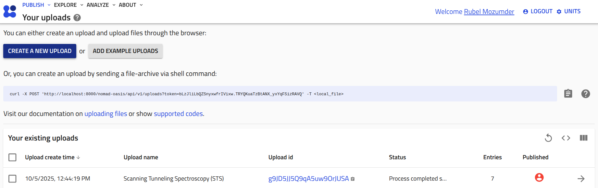
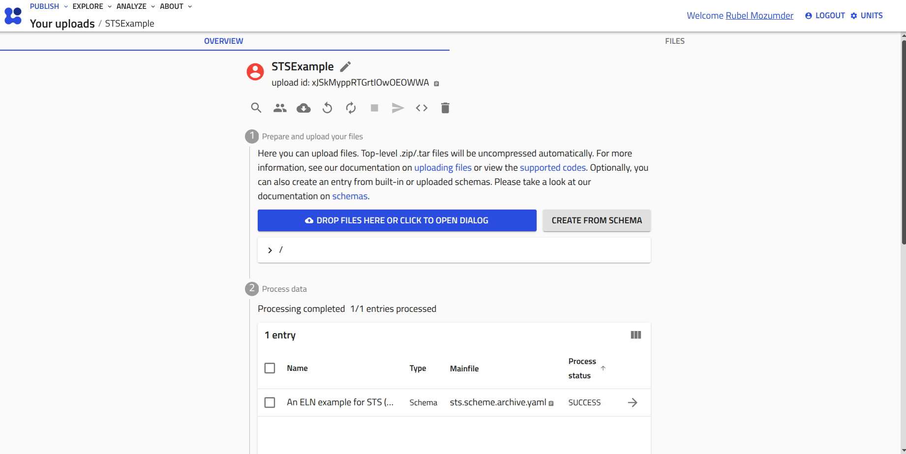

# __Use Reader in NOMAD__

The reader functionality of `pynxtools-spm` package can be used in [NOMAD](https://nomad-lab.eu/nomad-lab/) if the package is installed together with the `pynxtools` package in NOMAD. For instructions on installing `pynxtools-spm` with NOMAD, please follow the [installation guide](../tutorials/installation.md#install-pynxtools-spm-with-nomad).

!!! note
    To produce this tutorial, we used the following version

    `NOMAD==v1.1.17`, 
    `pynxtools==v0.11.1`,
    `pynxtools-spm==0.1.6`.

    Please ensure that you have the same version of `NOMAD` to get the same graphical user interface (GUI) as shown in the tutorial.
    In later version of NOMAD, the GUI may change, but the overall functionality should remain similar.
    
## __Use Example Available in NOMAD__

If the `pynxtools-spm` package is installed witas a plugin a NOMAD, three demo examples for __STS__, __STM__, and __AFM__ shall be available in NOMAD. Starting with these examples may help you to understand how to use `pynxtools-spm` readers' functionality in NOMAD.

<video controls>
  <source src="../assets/DemoFromExampleUpload.webm" type="video/mp4">
</video>

These examples in NOMAD can be utilized to extend or modify the reader input files, such as modifying the `ELN schema file` or `config file`, to customize the reader functionality according to user requirements. For details, see the [How to Interact with the Reader](../how-to-guides/how-to-use-the-reader.md) guide.

## __Drag and Drop Example in NOMAD__

The three examples above-mentioned may not be sufficient to store all data and metadata from an experiment. Therefore, you can modify the ELN schema file to structure and store metadata according to the application definitions. Below are a few steps to upload data in NOMAD using the drag-and-drop method:

__1.__ Create a NOMAD upload by clicking the `CREATE A NEW UPLOAD` button on the NOMAD upload page.

    

__2.__ Rename `unnamed upload` as desired, and drop the schema file (e.g., `sts.schema.archive.yaml`). NOMAD will create an entry.

    

__3.__ Create a NOMAD [archive](https://nomad-lab.eu/prod/v1/docs/reference/glossary.html#archive) entry. Based on the newly uploaded schema file, you need to create the archive from the `custom schema` option as the uploaded schema file is not a built-in schema in NOMAD.

<video controls>
  <source src="../assets/CreateArchiveFromCustomSchema.webm" type="video/mp4">
</video>

__4.__ After creating an archive entry, the data section will immediately be expand for adding input data along with raw data files. By filling in the required metadata (e.g., the name of the `nxdl`, software and hardware specifications), the data can be saved in a NeXus file.

<video controls>
  <source src="../assets/FinishupCustomizeUpload.webm" type="video/mp4">
</video>