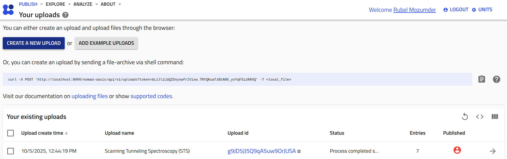
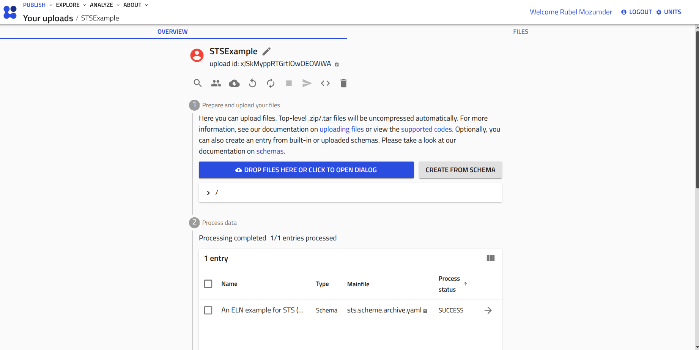

# __Use Reader in NOMAD__

The reader functionality of the `pynxtools-spm` package can be used in [NOMAD](https://nomad-lab.eu/nomad-lab/) if the package is installed together with the `pynxtools` package in NOMAD. For instructions on installing `pynxtools-spm` with NOMAD, please follow the [installation guide](installation.md#install-pynxtools-spm-with-nomad).

## __Who is this tutorial for?__

This tutorial is for experimentalists who want to store, organize, and share their STM, STS, or AFM data in NOMAD instead of converting files on their own machine. No Python knowledge is required — everything happens in the NOMAD graphical user interface (GUI).

## __What should you know before this tutorial?__

- You have access to a NOMAD installation (the [central NOMAD](https://nomad-lab.eu/prod/v1/gui/search/entries) or your own [NOMAD Oasis](https://nomad-lab.eu/prod/v1/docs/howto/oasis/configure.html)) in which `pynxtools-spm` is installed, see the [installation guide](installation.md#install-pynxtools-spm-with-nomad).
- You know which three input files the readers need — a raw (experimental) file, a config file, and an ELN file. They are described in [Reader Orchestra](../explanation/reader-orchestra.md#input-files) and in [Work with Reader](../how-to-guides/work-with-reader.md).
- It helps to be familiar with the [NOMAD glossary](https://nomad-lab.eu/prod/v1/staging/docs/reference/glossary.html), especially the terms *upload*, *entry*, and *archive*.

## __What you will know at the end of this tutorial?__

You will know

- how to run one of the built-in SPM example uploads in NOMAD,
- how to upload your own raw data with a custom ELN schema and convert it into a NeXus file,
- how to upload an already converted NeXus file and inspect it,
- what actually triggers the conversion inside NOMAD.

!!! note
    To produce this tutorial, we used the following versions:

    `NOMAD==v1.1.17`,
    `pynxtools==v0.11.1`,
    `pynxtools-spm==v0.1.6`.

    The current release of `pynxtools-spm` is `v0.3.0` and requires `pynxtools>=0.15.0`. In later versions of NOMAD, the GUI may look different from the screenshots and recordings below, but the overall workflow remains the same.

## __Steps__

The three routes below are ordered by increasing effort. Route 1 needs no data of your own, route 2 converts your own data inside NOMAD, and route 3 uploads a NeXus file you converted yourself.

### __1. Use an example available in NOMAD__

If `pynxtools-spm` is installed as a plugin in NOMAD, three demo examples are available. Starting with these examples may help you to understand how to use the `pynxtools-spm` readers' functionality in NOMAD.

Go to *Publish* → *Uploads* → __CREATE A NEW UPLOAD__ → __Use an example upload__ and select the category __NeXus Experiment Examples__. The three entries provided by `pynxtools-spm` are

- __Scanning Tunneling Spectroscopy (STS)__
- __Scanning Tunneling Microscopy (STM)__
- __Atomic Force Microscopy (AFM)__

Each example upload contains a raw data file, a config file, an ELN schema file, a filled archive entry, and a Jupyter notebook (`CommandLineDataconverter.ipynb`) that shows the equivalent command line conversion.

<video controls>
  <source src="../assets/DemoFromExampleUpload.webm" type="video/mp4">
</video>

These examples in NOMAD can be utilized to extend or modify the reader input files, such as modifying the `ELN schema file` or the `config file`, to customize the reader functionality according to user requirements. For details, see the [Work with Reader](../how-to-guides/work-with-reader.md) guide.

### __2. Drag and drop your own data__

The three examples mentioned above may not be sufficient to store all data and metadata from your experiment. Therefore, you can modify the ELN schema file to structure and store metadata according to the application definitions. Below are a few steps to upload data in NOMAD using the drag-and-drop method:

__1.__ Create a NOMAD upload by clicking the __CREATE A NEW UPLOAD__ button on the NOMAD upload page.

<div class="scrollable-img">
    
</div>

__2.__ Rename `unnamed upload` as desired, and drop the schema file (e.g., `sts.scheme.archive.yaml`). NOMAD will create an entry.

<div class="scrollable-img">
    
</div>

__3.__ Create a NOMAD [archive](https://nomad-lab.eu/prod/v1/docs/reference/glossary.html#archive) entry. Based on the newly uploaded schema file, you need to create the archive from the `custom schema` option, as the uploaded schema file is not a built-in schema in NOMAD.

<video controls>
  <source src="../assets/CreateArchiveFromCustomSchema.webm" type="video/mp4">
</video>

__4.__ After creating an archive entry, the data section will immediately expand for adding input data along with raw data files. Also drop the raw data file (e.g. `.sxm`, `.dat`, `.sm4`, or `.FLT`) and, if needed, the config file into the upload, and reference them from the entry. By filling in the required metadata (e.g., the name of the `nxdl`, software and hardware specifications) and saving the entry, the data is written into a NeXus file.

<video controls>
  <source src="../assets/FinishupCustomizeUpload.webm" type="video/mp4">
</video>

The resulting `.nxs` file appears in the upload next to the raw files, and its content can be browsed with the built-in [H5Web](https://h5web.panosc.eu/) viewer.

### __3. Upload an already converted NeXus file__

If you converted your data on your own machine with the command line interface (see [Use Reader from Command Line](../reference/standalone-usages.md)), you can simply drop the resulting `.nxs` file into a NOMAD upload. NOMAD recognizes the NeXus file through `pynxtools` and creates an entry for it, so the data becomes searchable and can be inspected with H5Web — no ELN schema or config file is needed in this case.

### __4. How the conversion is triggered__

It is worth understanding what happens when you press *save* in route 2, because this is where `pynxtools-spm` is actually called.

The ELN schema file defines a section that inherits from the NOMAD base section `NexusDataConverter` provided by `pynxtools`, and annotates which reader and which application definition to use (from `afm.scheme.archive.yaml` of the AFM example upload):

```yaml
sections:
  ELN_for_AFM:
    base_sections:
      - pynxtools.nomad.schema_packages.dataconverter.NexusDataConverter
      - nomad.datamodel.data.EntryData
    m_annotations:
      template:
        reader: spm
        nxdl: NXafm
```

The archive entry then instantiates that section. Besides the metadata filled in the GUI, it carries the three quantities that the converter needs — the reader name, the application definition, and the list of input files (from `AFMExample.archive.json`):

```json
{
  "data": {
    "m_def": "../upload/raw/afm.scheme.archive.yaml#/definitions/section_definitions/0",
    "reader": "spm",
    "nxdl": "NXafm",
    "input_files": ["config.json", "A151216.123306-02602.sxm"],
    "definition": "NXafm",
    "experiment_technique": "AFM"
  }
}
```

When the entry is saved, NOMAD writes the GUI metadata into an ELN file, hands it together with the files listed in `input_files` to the `pynxtools` dataconverter, and the dataconverter calls the `spm` reader. The reader picks the right formatter from the file extension and the `experiment_technique` field, and the result is written as a NeXus file into the upload.

!!! note
    The `reader` and `nxdl` values must match your technique: `NXsts`, `NXstm`, or `NXafm` — all with `reader: spm`. The `input_files` list must contain the raw data file and, unless the default config shipped with the package is sufficient, the config file.

## __Further reading__

- [Installation](installation.md)
- [Work with Reader](../how-to-guides/work-with-reader.md)
- [Use Reader from Command Line](../reference/standalone-usages.md)
- [Supported vendor files and formats](../explanation/reader-orchestra.md#supported-vendor-files-and-formats)
- [Schemas for ELNs in NOMAD](https://nomad-lab.eu/prod/v1/staging/docs/howto/customization/elns.html#schemas-for-elns)
